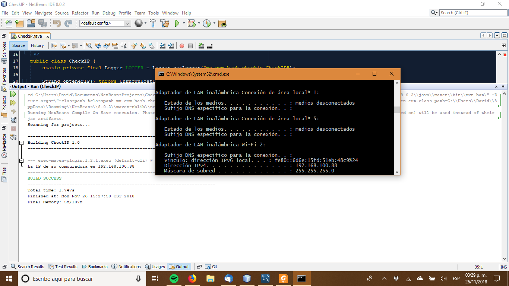

# Consultar la dirección IP desde Java


Considere la siguiente situación, su aplicación en Java esta ejecutándose en una
 red local y por motivos de seguridad, control de acceso o simplemente para 
almacenarlo en la bitácora correspondiente necesita la dirección IP del equipo 
en que se esta ejecutando su programa, ¿Como obtenerlo durante tiempo de 
ejecución? Aquí esta como.


## InetAddress
La clase InetAddress proporciona un método estático .getLocalHost() el cual le 
regresa la dirección IP v4 del equipo en que el programa se este ejecutando, el 
uso es tan simple como podría ser, solo llame InetAddress.getLocalHost() y 
obtendrá la dirección IP, solo recuerde capturar las excepciones que genera esa 
llamada.

## Ejemplo
Como es lo usual veamos un ejemplo sencillo para explicar todo esto, lo se hará 
es mostrar la dirección IP en pantalla.

```java
/*
 * To change this license header, choose License Headers in Project Properties.
 * To change this template file, choose Tools | Templates
 * and open the template in the editor.
 */
package mx.com.hash.checkip;

import java.net.InetAddress;
import java.net.UnknownHostException;
import java.util.logging.Level;
import java.util.logging.Logger;

/**
 *
 * @author David
 */
public class CheckIP {
    static private final Logger LOGGER = Logger.getLogger("mx.com.hash.checkip.CheckIP");

    String obtenerIP() throws UnknownHostException {
        InetAddress ip = InetAddress.getLocalHost();
        return ip.getHostAddress();
    }
    
    static public void main(String[] args) {
        try {
            CheckIP checkIP = new CheckIP();
            System.out.println("La IP de su compuradora es " + checkIP.obtenerIP());
        } catch (UnknownHostException ex) {
            LOGGER.log(Level.SEVERE, "Error al consultar el Host");
            LOGGER.log(Level.SEVERE, null, ex);
        }        
    }    
}
```

Una vez que ejecute este código le aparecerá en pantalla su dirección IP, la 
cual puede verificar con el comando ipconfig en Windows.
